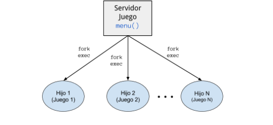

# Juego: Jalisco

Elaboraremos un programa servidor que lea un nombre y lance el programa Jalisco que atienda al
jugador en una ventana diferente. Enseguida el servidor se queda a la espera del siguiente jugador. El
servidor termina cuando recibe la cadena “Sayonnara”. Por supuesto, al recibir esta indicación el servidor
deja de recibir solicitudes y termina sólo cuando ya no hay jugadores activos.

Lo que intentamos realizar, se describe en la siguiente imagen:

***

## Desarrollo de solución

Este servidor implementara el uso del programa Jalisco, simplemente modificaremos el programa de Jalisco
para que no reciba el nombre del jugador. Esta parte sera complementada en el programa servidor.

1. Declaramos variables que ocuparemos para realizar este servidor.

        pid_t child_pid; → variable para almacenar la llamada al sistema fork()
        int status; → Variable para guardar el status de los procesos 
        int op;
        char cadena[20] = "hola"; → le asignamos una cadena para luego poder 
        compararla
        int i; → Variable para contar el número de proceso hijos. 
        int n = 0; → Como es un servidor, el programa debe de atender n solicitudes 

2. Preguntamos al usuario que ingrese su nombre y/o la cadena “Sayonnara”:

        printf("Ingrese el nombre del jugador\n");
        scanf("%s", cadena);

3.  Realizamos un ciclo while en el cual compararemos la cadena que se haya ingresado

        while(strcmp(cadena, "sayonnara") != 0){
        printf("Bienvenido al Programa\n");
        printf("\n1. Nuevo Juego\n");
        n = n+1; → incrementamos el contador
        child_pid = fork(); → Proceso actual que se duplico. 
        if (child_pid == 0) → fork() regresa 0 para el proceso hijo
        {
        //usar_execlp(); 
        execlp("xterm", "xterm", "-e", "./jalisco", NULL);
        //execlp("konsole", "konsole", "-e", "./jalisco", NULL);
        }
        printf("Identificador hijo: %d\n", child_pid ); → Imprimimos el 
        identificador del 
        hijo
        //Pide de nuevo el nombre
        printf("Ingrese el nombre del jugador\n");
        scanf("%s", cadena);
        }

  * NOTA: Es muy importante marcar la llamada al sistema que hace execlp: 
  execlp("xterm", "xterm", "­e", "./jalisco", NULL);
  Como podemos ver, hacemos un llamado a la terminal “xterm”, simplemente hacemos  
  uso de “-e” que indicara a la terminal “xterm” que debe ejecutar el comando ./jalisco. 
  
4.  Por ultimo realizamos un ciclo for, para esperar a todos los hijos a que estos terminen, esto solo sucedera si la cadena ingresada en la palabra “Sayonnara”:

        for ( i = 0; i < n; i++)
        {
        /* code */
        //Esperamos a que todos los hijos mueran y terminen su procesamiento. 
        wait(&status);
        }
  
  * NOTA: Para poder visualizar mejor el árbol de procesos que se debe de crear, es necesario abrir otra terminal. 
  Colocando en la terminal: pstree <parent_id> -c Esto dara una mejor visibilidad al problema que se plantea. 
  
    pstree 8134 -c
    servidor2─┬─xterm───jalisco
              ├─xterm───jalisco
              ├─xterm───jalisco
              └─xterm───jalisco
